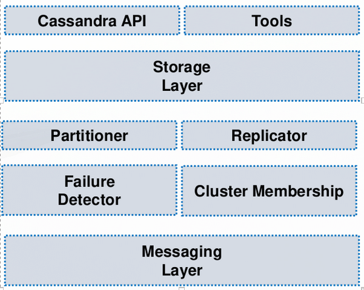
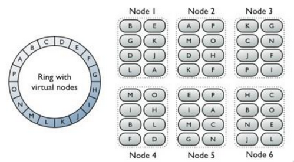
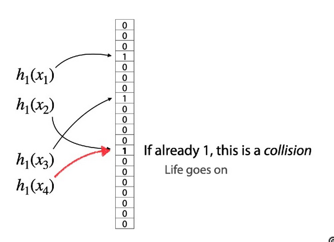
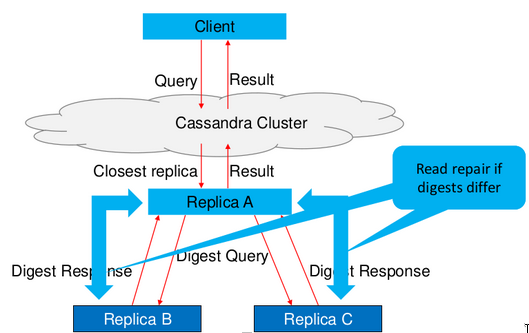
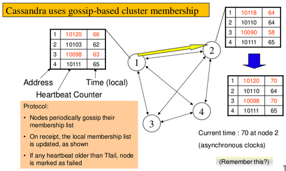
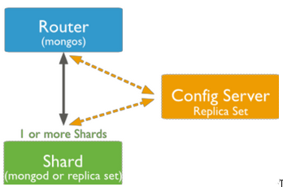
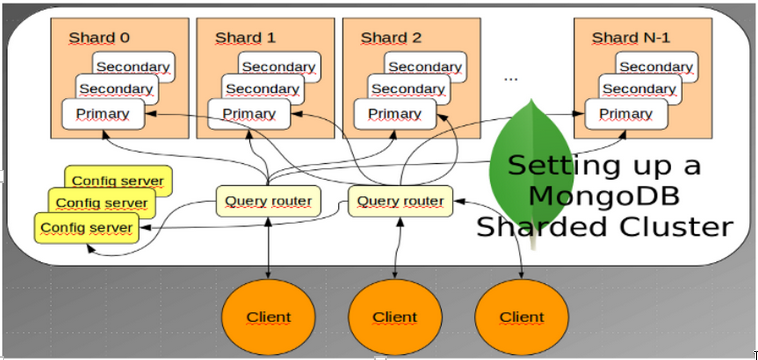

# Data Storage

New tools for data storage of big data, with renovated level of quality: less conventional NoSQL distributed storage systems based on new principles.

In realtional DBs there is a schema of the tables, they are made of values in form of tuples. The tuples space is extremely rigid, each tuple is unique and cant have null values. These assumption can work well on small systems, but growing they can't guarantee fast answers, which clients are asking for.

Availability is more important than consistency: noSql schemas are offten incomplete or has serveral schemas for the same data in different forms. Each form depends on the kind of queries your clients do. How does it take to customize the repository of data? (Remind of in-band/out-band operation) Changing data's form is an out-band operation, usually batch and computational expensive.

## What are clients asking for?

- flexible schema-less data models
- weak consistency and high availability
- high replication to not move data around DCs in-band
- Distributed indices, hashing and catching
- Partioning across local and remote servers (inside same DCs)
- Scaling horizontally

Relation DBs instead are:

- Tables composed ny rows
- Schema-based, strucuted complete tablespoon
- Each row has a primary key, unique in the table
- Quetries with SQL
- High and deep use and support for joins and foreing keys  
- Scaling vertically

The relational DB are often not adeguate for the datas I want to store:

- **Data are extremely large and unstructured**
- Lots of random reads and writes (not quite sure about that: lots of reads and few random writes)
- Sometimes write-heavy operations
- **Foreign-keys and joins are rare**

### Difference between scaling

- Scaling up/vertically: grow cluster capacity by replacing more powerful machines
- Scaling out/horizontally: incrementally grow you cluster capacity by adding more **COTS machines (components off the shelf)**

## Different NoSQL data models

- Key-value Stores: data are manages as (key,value) pairs. (Also seen in DHT)
- Document Stores: Key-value stores with value as a document encoded in standard formats, as Json or XML (MongoDb)
- Wide-column Stores: Data stored per column-family dynamically and flexibly (Cassandra)
- Graph Stores: graphs for storing data efficiently

Data and queries are not regular and sometimes are forecastable. With noSql DBs it is possible to prepare your data dfor the usage you want to optimize, expensive but out of band. Instead, Relational DBs gives the most general purpose representation, but most times is useless. the main reason relational DBs are so widely spread is because they were used as integration for different technologies and small distributed systems.

### Key Value

Necessary operations: ` get(key) ` and `put(key, value)`

Tables:

- Similar to RDBMS, but unstructured: **do not have schemas**
- Do not always support joins nor have foreign keys
- Can Have index tables, just like RDBMS
  - "Column families" in Cassandra
  - "Table" in Hbase
  - "Collection" in MongoDB

### Column-oriented storage

NoSQL systems tipically store one column (or a group) together. Entries within a colum are indexed and easy to locate given a key (and vice-versa).

Range searches within a column are fast since is not needed to fetch the entire database.

Cassandra is designed for cloud datacenters: made for replication (one copy on the nearest node)

## Cassandra

A distributed key-value store intended to run in a datacenter (also inter-DCs). It's now an Apache project. The name came from the Trojan priestess forecasting true prophecies, but never believed by others.

Cassandra maps several DCs to be organized in a global cloud, interconnected by high bandwidth and high quality communications among each others. **Cassandra uses DHT to grant quality and replication automatically**.

Cassandra works internally with message passing (multicast), as asynchronous as possible.

Few basic principles:

- data are kept in memory, not in disk: on disk only unmutable values. (several cache copies)
- Configuration in out of band

Datacenters must be organized carefully to favor the local intra-DC organization and the inter-DC infrastructure. Some policies for configuration must be decided and actuated out of band (before data access) and operations must be monitored and controlled during execution (in band monitoring and dynamic configuration).

Cassandra is well oranized in a core hierarchyof concepts that constitute the bottom architecture:

- Cluster: is the set of all possible servers in all datacenters
- DataCenter: Server in a DC
- Rack: Is a logical group of nodes within the ring, is a collection of servers in the same DC.
- Server: a machine with an instance of Cassandra installed. (Node)
- Virtual Server: is the data storage layer within a server. There are 256 nodes per server by default.

Cassandra target is to reach **$120 \%$ of utilization**.

Cassandra **maps virtual nodes in a ring** on a Node (server), a partition is the basic data unit replicated on virtual nodes. They are controlled by the partitioner.

### Cassandra KeySpace

KeySpace (KS) are **namespace container** that defines the data replication on nodes: tables, numbers of replicas, replicas strategies, ecc...

A KS has a replication factor (RF) and a replica placement strategies:

- Data replication is defined per datacenter
- max(RF) = max(number of nodes) in only one data center

### Strategies for replication

Two simple strategies for **replication based on partitioning**:

- **SimpleStrategy**: replication at DC layer, with two possible strategies of partitioning.
   1. Random partitioner: chord-like hash partitioning
   2. Byte ordered partitioner: Assigns ranges of keys to servers.Easier for range queries (*"all users starting with [a-b]"*).

   The Data are replicated on $N$ nodes, where $N$ is the replciation degree.

> A partitioner is a function for deriving a token representing a row from its partition key, typically by hashing. Each row of data is then distributed across the cluster by the value of the token. [Cassandra doc](https://docs.datastax.com/en/cassandra-oss/3.x/cassandra/architecture/archPartitionerAbout.html)

- **Network Topology Strategy**: for multi-DC cluster deployments
  1. Uses an algorithm to destribute data across different DCs.
  2. First replica on primary node, other replicas on different racks and on others DCs, so on until it has allocated all the requested copies.

### Snitches

Snitches must map IPs to racks and DCs. It can be:

- Simple snitch: unaware of topology
- Rack inferring: assumes topology from IPs
- several others

### Write Operations

Write operations must be lock-free and fast.
Clients sends write to one coordinator node in the Cassandra cluster:

- Coordinator may be:
  - per-key: ensures that writes for the key are serialized
  - per-client
  - per-query

The Coordinator uses the partitioner to send query to all replica nodes responsible for the key. When **at least $X$** replicas respond, coordinator returns an acknowledgement to the client.

**$X$ is the majority**.

while the writing is going on there are not grantings for the reading. Community wants more safety for reading. Most important is to get the trend: Cassandra can offer something for every customer, several strategies possible.

### Write policies

Always writable: Hinted Handoff mechanism

- If a replica is down, the coordinators writes to all other replicas and keeps the write in buffer till the replica is up again (till 3 hours)
- Election done via Zookeeper of per-DC coordinator (has to coordinate with other DCs)

### Bloom Filter

Technology to index things to know if something is present or not. It's based on compact table to hint for location. Compact: must be cheaper looking for existence in the filer than actually looking for it. Uses key-values: hashes on $\bmod M$ as key and a flag as value. There can be **some false positives**, but **never false negatives**.

### Delete

Cassandra do not delete items right away, but adds a tombstone to the log. Eventually, when a compaction encounters a tombstone it will delete the item.

Reading or writing helps checking the copies and reparing. Even on the same rack you can have different values, in this case are used timestamps.

### Reads

Similar to writes, but the Coordinator can contact $X$ replicas, generally the quickest in the past, and takes the **latest value among the $X$ answers**.

Reads are very fast, but after a reading there is always repairing: that makes reading more expensive than writing.

### Gossip protocol and heartbeat

The gossip procotocol is made of messages with the goal of consistency, a kind of vector clock. Any node can be a coordinator, so every server needs to maintain a list od all the oither servers that are currently in the cluster. The list must be updated automatically as servers join, leave and fail.

It's critical, but can't be expensive. Uses a simple heartbeat, suspicion mechanism to adaptively set the timeout based on underlying network and failure behavior. Each members calculate his own **Phi, which is the inter-arrival times for gossip messages.** Generally, $\phi=5 \rightarrow 10-15 s$ detection time.

### Consistency levels for Cassandra

Client is allowed to choose a consistency level for each operation (read/write).

- **ANY: any server** (might not be replica). Fast: coordinator caches write and replies quickly to client
- **ALL: all replicas**. Ensures strong consistency, but slowest.
- **ONE: at least one replica**. FASTEST, but cannot tolerate a failure.
- **QUORUM: quorum across all replicas** in all DCs.

The quorum can be different form reads and writes.

### Standard Quorum

Each read or write can have a quorum, (depends on the coordinator). A quorum involves >50% nodes agreeing on something, these means that 2 consecutive quorum must have a common node: **this ensures quorum consistency**.

In blue there is a write quorum, in red a read quorum: at least one node returns latest write. **Quorum is faster than ALL**, but still ensure strong consistency.

### Tuned quorum

$R =$ read replica count, $W =$ write replica count, $N =$ vnodes

1. $W+R>N$
2. $W>N/2$

Select value based on use cases:

- $(W=1, R=1)$ very few writes and reads
- $(W=N, R=1)$ great for read-heavy workloads
- $(W=N/2 +1, R=N/2 +1)$ great for write-heavy workloads
- $(W=1, R=N)$ great for write-heavy workloads with one client writing per key

Other two consistency levels:

- Local quorum: quorum in the coordinator DC. Faster than quorum
- Each quorum: each DC does his quorum, then a hierarchical quorum

### Final consideration on cassandra

Cassandra follows users from novice to ecperts letting tuning the parameters to every single key. Cassandra is both key-value store and Cloumn oriented.

## MongoDB

Document store DB, they define a xml/json/proprietary format for documents. Heavy configuration out of band, very fast in band. As many others is based on shards.

Mongo has a distributed architecture: a router, the access point, tells you where to find data. Collection partitioning using shard key: hash-based to obtain a balanced distribution (not granted).

Architecture:

- Router to accept and route incoming request coordinating with config server
- Shard, data store

Mongo automatically balance shards (migrates chunks of shards if there's uneven distribution).

### Replication

The configuration can grant different properties:

- Several routers to accept incoming requests
- Config servers to give access to routers

The system is capable of supporting dynamic access to documents.

Mongo uses BSON, binary Json, reminds of RDBMS.

Leader election protocol elects a master. Some nodes dont maintain data, but can vote, as arbiters

### Read preferencies/policies

- Primary preferred
- Secondary
- **nearest**: helps reduce latency, improve throughput, reads from secondary may fetch stale data.

### Write concerns

Which guarantees does mongoDB provide on the success of a write operation? 

On a write operation, the client can specify the write concern, which is the level of acknowledgment requested from the server. The write concern can specify how many `mongod` must acknowledge the write, if the write must be written to the journal (of the primary) and a timeout to avoid indefinite blocking.

Weaker writes concerns implies faster write time.

