# Replication

## Definitions

- Fault: set of events in a system that can cause errors

- Error: any problem that can generate an incorrect behavior

- Failure: any behavior not conforming with the requirements

> *Fault is the concrete causing occurrence, error is the sequence of events that can generate the visible effect of failure.*

### Fault

- **Bohrbug**: repeatable, easy to be corrected

- **Eisenbug**: Tied to specific runs.

Any system can crash :arrow_right: it must recover to work safely again.

#### Service unavailability - Downtime

We need phases of fault/error **identification** and **recovery**.

We count in number of 9s the percentage of availability of the service. It counts the *frequency of cashes* and the ***capacity of fast recovery***.

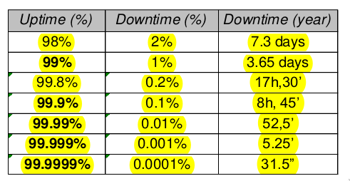

#### Properties definition

- **Dependability**: the customer has full confidence in the system.

- **Availability**: **correct(?)** answers in an agreed limited time.

- **Reliability**: Only correct results (**no time constraints**).

- **Recoverability**: (recovery via state persistency)

#### Fault id and recovery

Fault must be tolerated without causing failures. The design of an architecture can be very hard, assuming faults simplifies the duty.

- **Single Fault assumption**: one fault at time, during recover no fault occurs.

**With 2 copies we can identify 1 fault.** We can continue with the residual copy. **With 3 copies we can tolerate one fault, and we can identify 2 faults.**

Always avoid single point of failure. **Unique points must be available at any time**.

> **With 3t copies we can tolerate t faults**

#### Types of fault

- Fail-stop/fail-fast: One process fails by stopping as soon it finds an error. Stopping all the other processes can verify its failure state. With this behavior the system **Needs 3 processes to keep it available**.
- Fail-safe: The failing processes tries to get back at a safe state even with a fault. The other processes can't verify the failure state. **Needs 2 processes to keep it available**

#### Fault assumptions

- Send and receive: fails sending/receiving only some messages

- General omission: process omits some behavior or by halting

- Network Failure

- Network Partition: fails by partitioning the system in two parts that cannot communicate with each other.

#### Measurements and High level goals

Availability and reliability:

- TTR: Time to Recover.

- MTTR: Mean time to recover.

- TBF: Time between failures

- MTBF: Mean time between failures

**Availability**:

    A = TBF / (TBF+TTR) * 100

**Reliability**: probability of an available service depending of the time and based on a period delta-T

    R(0) = A, R(delta-T) = reliable over time delta-T

- **Correctness** = Safety -> **Reliability**

- **Vitality** = Liveness -> **Availability**  

To tolerate occurring faults a system must grant **safety and liveness. To grant this must consider **replication.**

### Type of Replication

1. Passive copies: only one compunent executes, the others are as backup
2. Acrive copies: All components are equal in role, execute the same operation to produce a coordinated unique result. (Max throughput in a cluster of processors)

#### Examples: Stable Memory

Stable memory uses replication. Limiting fault assumption: probability of multiple faults over related memory components.  **single fault assumption**
Any error is converted to an **omission**.  
Blocks are organized in two different copies. (**replication degree is two**)
Any operation operates on both copies (**active**), whren any action comes to an incorrent block it is considered an omission and **starts a recovery protocol**.

- If one copy is correct, the protocol copies the value.
- If the 2 copies are correct but inconsistent, One content is enforced.

#### Examples: Tandem

It's a special purpose architecture (banks). It has a replication level two for every systek component. Its a fail-safe system, dependable with single fault assumption.
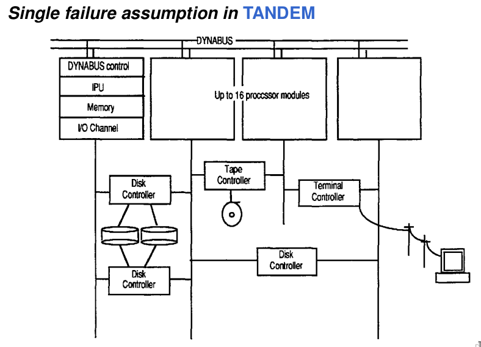

#### Examples: RAIDS

General-purpose organization of disks with a replication goal
but low-cost intention well spread and used market solution.
General-purpose organization of disks with a replication goal

- Striping: parallel I/O but redundancy. (Partitioning)
- mirroring: maximum redundancy
- Distributed Partity disk: disaster tollerance

> Raid stands for: Redundant array of inexpensive disks

#### Fault tolerant support

Fault tolerance requires support, protocol and resources:

- Complex algorithm
- Complex implementations

Recovery procols myst be more reliable than the application itself.

- Special purpose -> ad-hoc resources with even better QoS (avionic)
- General purpose -> fault tolerance support insistes on user resources

#### High Replication Costs

Dependability costs are generally high in the two senses and dimensions:

- Space: Resources available
- Time: answer and service timing

Memory and persistency costs:

- Communication overhead
- Implementation complexity

#### Resources Management

Replicated resources in distributed systems need of coordination of them toward a common goal (also software fault-tollerance).

- Replicated Resources: multiple copies on different nodes
- Partitioned Resources: Multiple copies on different nodes **working independently**

**Redundancy**: can suggest architectures to get a better QoS replication of processes and data

> The greater the redundancy, the better the reliability & availability, the greater the cost and overhead

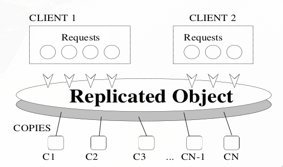

## Replication Model

### Passive

Also know as *"primary/backup"*: Only one copy executes, the others are backups.

Primary is externally visible and manages the whole resources.
Only one copy is fresh and updated (**hot copy**), the can also be obsolete in state and not updated(**cold copy**).

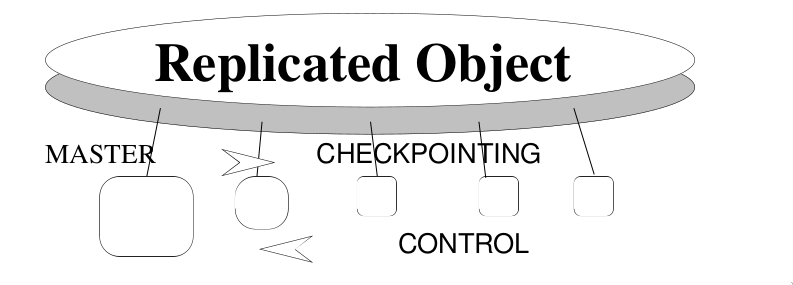

#### architecture

In case of a failure and only cold copies, one must start repeating from the previous state, to produce the updated state.

**Fault Recovery**: Who identifies the fault and when?

Secondary copies (slaves) **must identify** the fault of the master by observing its activity, like application messages coming from the primary:

- One slave for the **control protocol**
- A hierarchy of slaves and more comples protocols  (multiple faults tolerace)

#### check-point

The primary updates the replica state via check-pointing. **The update is made in chain**: First replica updates the secondary, ecc...

The primary updates:

- Before answering the client: safe but slow answers
- After answering the client: fast answers but not much safe

The checkpoint can be:

- time-driven (periodic)
- event-driven

In case of a **sequential resource**, the state is more clear and easy to indentify and establish. In case of a **parallel resource**: Checkpoint at entrance/exit and in specific decision points.

### Active

All copies execute all operations in a more or less synchronous way and with some forms of coordination among copies

In TRM (*Triple modular redundancy*): three copies. We can tolerate one fault, identify up to two fault.

#### copies coordination

- perfect synchrony (strict consistency)
- Not synchronous, but all copies agrees on the final action

Less synchronous strategies costs less in time, make protocols easier but grant less: **Eventual consistency**.

State updating must happen before delivering the answer to grant a complete consistency, impacts on response time. (**eager vs lazy policies**)

In case of a failure there must be a way to give and answer anyway -> there is already much delay.

Copies can reach an agreement before giving the answer:

- Full agreement (expensive)
- Majority voting with a quorum

There is a strict need of monitoring and execution control -> The less the coordination the less is the cost.

> Clustering is an active solution non fault tolerance oriented.

#### Phases of an active protocol

1. The client send the request: Only to one copy. That copy should prepagate the request to all others one.
2. The copies coordinate with each other to define a global schediling. One master copy can be the maager of this phase.
3. Execution: some scheduling can be avoided or prevented.
4. All copies must agree on the result to give back: commit or undo some actions.
5. This phase has the goal of delivering the correct result to the waiting client.

The coordination introduce high overhead -> low replication and simple policies.
This model: **Eager consistency and lazy availability.**

#### To classify some FT resources replication

- who decide the updating:
  - only the primary
  - all copies

- when to propagate the updates:
  - eager / pessimistic
  - lazy / optimistic

#### Eager Primary Copy

One primary executes and gives back the answer only after having updated the state of all copies. (One operation at time with faults).

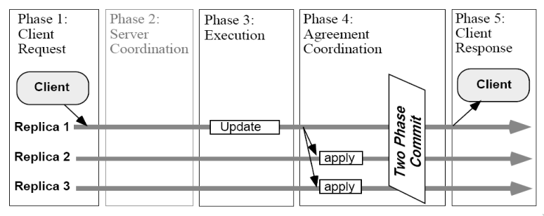

Eager policies favor consistency and correctness. not very fast precocious answers.
**Two phase commit** toward consistency granting:
    - a posteriori coordination: verify consistency
    - a priori coordination: correct messages

#### Lazy Primary Copy

The manager executes, answers the client and afterwards updates the copies using  **reconciliation**. *Some problems may occur if there is a manager crash.*

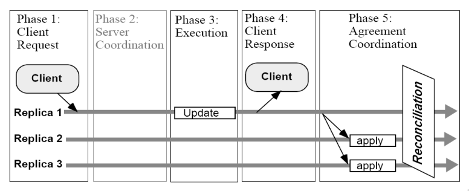

#### Eager for all copies

- **Optimistic approach**: **Uses two phases commit** then afterwards answer is provided to the client. (optimistic, can be undo of the commit if not accepted by all)

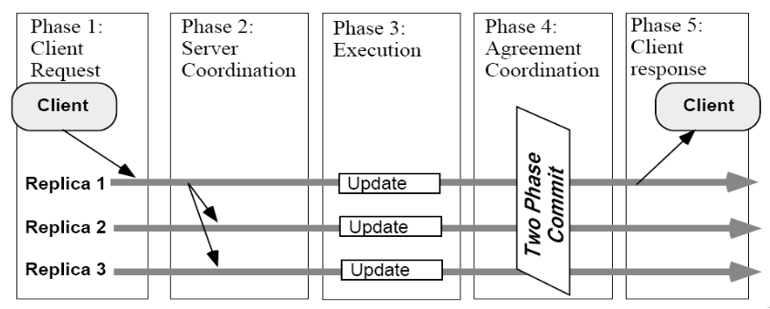

- **Pessimistic approach**: one can use **atomic broadcast** to reach every copy, this means **it is granted order and there is no need for final check**. More initial assumption and cost.

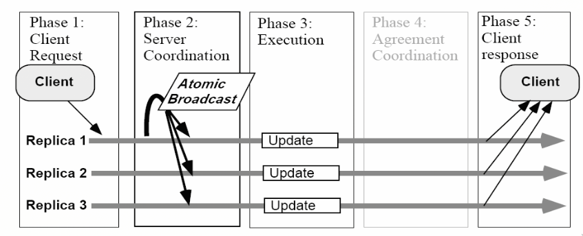

#### Example: Storage Area network

Is a set of interconnected resources with several QoS to get Storage resource with out any capacity limit. (**Storage as a Service**)

### High availability cluster

Consists of a set of independent nodes that cooperate to provide a dependable service, always on 24/7. Provides:

- Service Monitoring: ascertain current QoS
- **Failover (Service Migration)**: hot migration of a service immediately after a crash. Must take place very fast to limit service unavailability.
- heartbeat (**node state Monitoring**): check node state to monitor any copy state or failure.

#### heartbit and failover

In case of failover, the data must be available to the new node of the cluster via shared component over the cluster. lightweight heartbeat protocol.

#### Example: Red Hat cluster

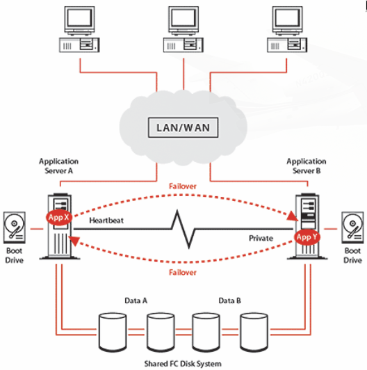

With openstack:

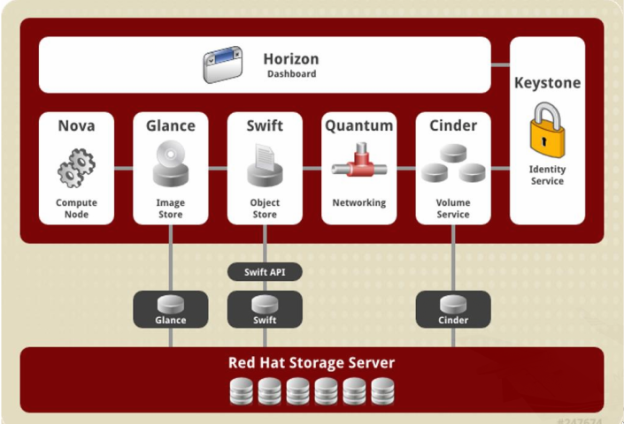

### Optimistic Lazy Policy

Optimistic policy that can deliver the answer very fast.
Amazon **renounces to any strict consistency** and provide both cosistent and **eventually consistence** operations.
**Eventually consistency**: updates are commanded but not waited for. Copy values are reconciliated and consisten view is achieved. **Incosistency Windows** may depend factors: communication delays, workload, replication.

#### Example in S3

You can define your data replicated in different buckets: You can have either a copy
Same-Region (close to you) or in a distant bucket Cross-Region Replication.
CRReplication in some cases can overcome big crashes, but it takes time to propagate.
SRR can be fast but maybe subjected to common crashes.

Amazon S3 lets you also control not only the location but also the timing of the operations via S3 Replication time Control

#### Example on Docker swarm

Docker Swarm can also allow high availability and can replicate also the manager for the distribution to overcome the single point of failure of the manager.

#### Apache zoo-keeper

Service for storing limited client data, by using a distributed replicated cluster of nodes, with Qos.

The internal architecture is based on several nodes to keep in memory data clients are interested in getting very fast. **Replication Leader-follower/primary-replica model**.

**zookeeper nodes** organize a namespace UNIX-like. Znodes elect a leader, majority voted to control data. Clients can add ephemeral nodes (copies with limited lifetime
dependent on client presence).

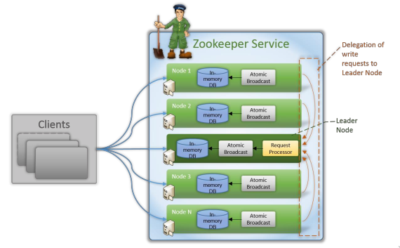

Znodes create **in memory copies of client requested data**. Permanent Znodes uses **passive replication**. The master is elected and it is capable of triggering also clients interested in the data change.

A simple set of primitives is available to client (Java & C):

- Create (path, data, flags) and Delete (path, version)
- getData (path, watch)
- setData (path, data, version)

The servers are capable granting access to fresh data to the group of authorized clients via transaction numbering (transactionID).

**In case of leader crash**, the Election is based on the
**most recent data change** among znodes (transactionID), via **majority voting**.
Election is also possible in case of Data Centers partitioning so to **work disconnected**.
