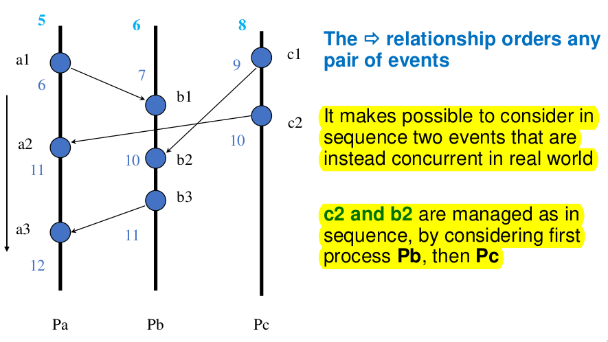
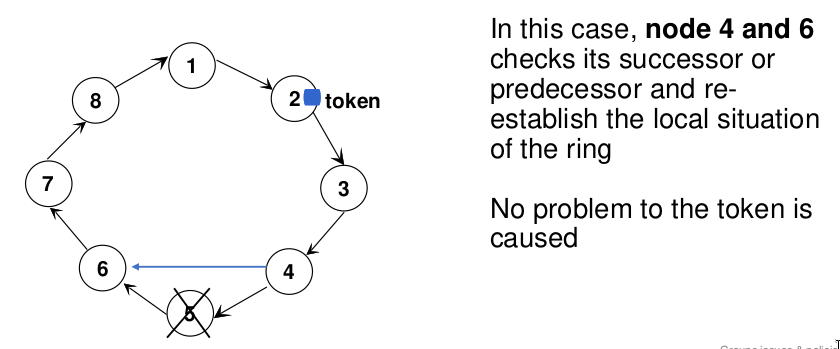
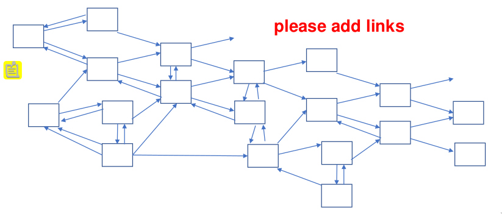
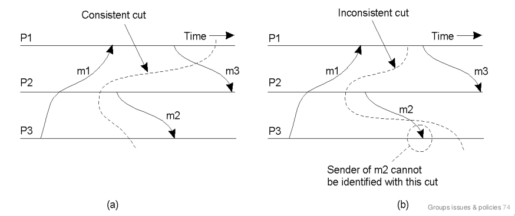

# Partitioning and Groups

Important aspect: how to partition entities in groups of replicated entities.

- partitioning for scalability
- replication for availability

## Semantics in multiple commmunications

which protocols?

### Multicast semantic

Semantic of sending to many receiver. What does it mean the sending succed:

- One received?
- Most received?
- All received?

Do I have to wait all the acks? I can have several sender in a group.

#### Group memebers reception semantic

- **reliable** -> guaranteed delivery. (with resending)
- **unreliable** -> only 1 attempt (chorus), Leaving the duty to the other members of the group to propagate.
- **Atomicity**: in the group means that the scheduling/ordering inside the group is the same for all the members.

Essential Element:
We must think not only to the semantics of a single action, but
also to message ordering in a multiple action occurrence (and
consider their synchronization):

> If you want the same order in on different nodes, it is very hard and expensive. Not easy to scale. If the copies work autonomously you have a much lower overhead to order, you have only to take care about communication.

#### Reliable Multicast

Can be achived if:

- No sender crash
- No receiver crash
- No message omission

Necessity of fault identification and recovery through monitoring of multicast and group. Extra overhead.

The support introduces:

- **Negative ack**: I dont send any ack, I send only an Ack only when I listen something when something is missing or misplaced.

- **Hold Back**: holds a message until all the previous reached the destination

#### Atomicity vs No ordering

**Atomicity**: we focus on the reception order of messages by any alive members of the group.
**No order**: all receivers can present a different ordering in any copy.
No ordering poolicy is very easy to support.

### Ordering

- fifo ordering: messages received **same order in which are sent** from the group.
- cause-effect ordering: **Received in the same order they where caused** (then sended). two different servers send 2 messages, the messages must arrive in the order they where caused.  
- total ordering: **All the messages are received in the same order by all the group members**. The order is the same for all the members, but not necessarily the same as the sending order, causal-effect or fifo.

> **Causal ordering example:** (m1 and m2 from S1), (m3 and m4 from S2), **(m1 causes m3)**. Possible arriving order:
    - (m1 m2 m3 m4)
    - (m1 m3 m2 m4)
    - (m1 m3 m4 m2)
    - NOT m3 m1 m4 m2

#### Atomic ordering (total ordering)

**ATOMIC ordering guarantees that all messages are received in the same order by all group members.**
Impossible to forecast any order, but is important to dinamically agree on one and should be the same for all.
The enforcing of orderings is expensive.

- Minimun cost: no ordering
- Fifo and causal: **Partial orderings**
- Atomic: Total ordering

Atomic ordering can follow anyway a causal and/or fifo policy. Cost for atomic ordering can be very different. An example of atomic broadcast is Zookeper AB.

#### Multicast ordering

- FIFO multicast: ordering only from the same sender
- Causal multicast: causal ordering
- **Lamport ordering**

Simple way to implement atomic orderd for messages comiing from the outern: **one node becomes also the entry element, front end**. This solution comes with drawbacks:

- SPoF
- Unfair management: outern neighbors can be favored. **Low cost but unfair.**

Alternative: mobile co-ordinator with a **Cirtulating token**

#### How to achieve synchronization

Synchronization: Ordering on events. Provide a consistent view of the system to the entire set of communicating processes.
Synchronization by using **physical time** and **physical clock** it's typical on one local environment only, **absolutely not feasible on distributed and global system**.

Enter UCT, the universal coordinated time. NTP is the synchronization protocol able to achieve an agreement on physical clock. Uses a server hierarchy with a small numbers on level to provide clock with small errors. Still remains **hard to avoid conflicts and clock drifting with limited overhead**.

Several Distributed Synchronization Methods: discrete time and ordering of a event subset:

- Ordering logical time of Lamport
- Token Passing LeLann ring strategy
- Event ordering based on priority

## Lamport relationship

Only some events are considered in the distributed system.

- Local
- Remote (send / receive events form one process to another)

Lamport considers only _relevant_ events and aims at creating a simple ordering policy.

Consider events caused by a set of processes that communicate through message passing. Lamport wants to capture the cause-effect relationship.

**Heppened Before relationship**:

- If a and b are events of the same process and a occurs before b, then $a \rightarrow b$ (local order)
- If a is the sending event in one process and b is the receiving event within another process, then $a \rightarrow b$ (communication interprocess)
- If $a \rightarrow b$ and $b \rightarrow c$, then $a \rightarrow c$ (transitivity)

The relation $\rightarrow$ introduce a partial ordering in some systems events and among all events, **it's not a total ordering**. Two events are concurrent ( $\uparrow\uparrow$ ) if **not $a \rightarrow b$ and not $b \rightarrow a$**.

> :warning: Total ordering is a different thing: **T.O. means each node agrees on the same order of events**. "Happened before" is a partial ordering and wants to define a causal-effect ordering.

We don't assume a unique global clock (global time), but **allow for a set of local clocks (local time).**

We work in an **Asynchronous environment** that makes possible high trasmission delay (very very long, but any lost messages). We need several ordering strategies, also gloabal or total to synchronize. We want **to build a logical time system based on the $\rightarrow$ relationship**.

### Logical Clock

We need to build a logical clock/timestamp to assign a "number" to each event, "happened before" is only partial.

Define $TS(i)$ as the timestamp of the event i:

- if $a \rightarrow b$, then $TS(a) < TS(b)$.

We can then define the **clock condition LC** (which defines the timestamp $TS$ for an event taking into account the $\rightarrow$ relationship):

- C1: Given a and b, if $a \rightarrow b$ then $LC(a) < LC(b)$

    > Note: It is not true that if $LC(a) < LC(b)$ then $a \rightarrow b$

- C2: For $\forall a$ and $\forall b$, if $a$ is the sending of a message in the process $P_i$ and $b$ the reception in the process $P_j$, then $LC(A) < LC(b).$

Implementation Practices:

- Every Process $P_i$ increments $LC_i$ between any two events
- For $\forall a$, sending of a message in a process, the message contains a clock as timestamp $TS=LC(a)$
- For $\forall b$, reception of a message in process Pj, the process put the logical clock at the greater value between current clock and timestamp $LC_j = max( TS_r, LC_c ) + 1$ _(r received, c current)_

These rules introduce partial order relationship, **many concurrent events $a \uparrow\uparrow b$ with equal timestamp.** **Who doesn't receive doesn't update**.

What is the relationship between the b2 and c2 events (same timestamp)?

#### Ordering and Reality

The lamport relationship $\rightarrow$ is a logical one and it is loosely connected with the real world. Who recieves messages updates its time. Who do not receive messages may maintain a very low timestamps.

- **Causality problem in clocks**: two events considered by lamport in a causal relationship can instead be not related at all.
- **Hidden channel problem**: can lead to a situation that do not respect cause/effect relationship.

#### Total Ordering and $\Rightarrow$

Sometimes it is necessary to introduce some total order relationship between all the process in the system.

Enter $\Rightarrow$ : a global order relationship, based on $\rightarrow$, the lamport partial ordering.

$a \Rightarrow b$ if and only if:

- R1: $LC_i(a) < LC_j(b)$
- R2: $LC_i(a) = LC_j(b)$ and $P_i < P_j$

Total ordering assumes ther is an order between all processes.

## Vector Clock Ordering

Consider a vector of logical clocks (Vector clocks) to order events in a process set.

Processes must maintain a vector of all known clocks of processes and use that in communication.

A vector clock `Vi[k]` contains information on what a process i knows about the clocks of other processes.

the process i in the vector keeps:

1. `Vi[i]` its timestamp
2. `Vi[k]` the timestamp of any other process Pk at its knowledge

So the data structure is more complex for processes and also for the protocol to communicate and update the vector.

### Vector clock protocol

1. Every process Pi increments `Vi[i]` between two events
2. For $\forall$ sending of a message, the message contains the whole vector clock (after incrementing its own entry)
3. For $\forall$ reception of a message Pj increments its own `Vj[j]=Vj[j]+1` and updates its vector according to `Vj[k] = max(Vi[k], Vj[k])`

This protocol permits a wider iformation propagation and permits a wider information exchange and diffusion.

**Lamport clock cons** is that events not in the $\rightarrow$ relationship can be taken as if they were. The **vector protocol instead pays the cost of the propagation** of the entire vector and **requires adjustment at the receiver**.

In the vector clock algorithm cuncurrent events can't be recognized as sequential.

## Synchronization

Scenario: Access a resource in a mutually exclusive way

Objectives:

- Safety: Only one process at a time can have access to the resource
- Liveness: Every process that has done a request the access after a limited delay
- Fairness: Each process get a chance to access the resource

> :question: Difference between liveness and fairness: liveness is a guarantee of access, fairness is a guarantee of access to all processes.

We **exclude fixed priorities that are unfair and can cause starvation**

### Single coordinator process

- Approach completely centralized considers a unique coordinator process
- Every process sends the request to the coordinator and after usage, notifies it
- Coordinator must grant mutual exclusion

The coordinator can decide different policies (fifo, ecc).

#### Protocol

1. A process sends a request message to the coordinator
2. Coordinator collect the requests and decide to which one reply to.
3. The user of resource must send a release message to the coordinator

**3 messages for every access to the critical section.** Disavdvantages stemming fron the centralized and unique role of the coordinator.

- Spof
- Potential unfairness

### Lamport Protocol

Every process has a local queue of received messages ordered ($\Rightarrow$) by timestamps.

The local queu initially contains the message `T0:P0`, lesser than every clock in the system. **Clock is a logical time:** couple of int (Timestap, Process owner).

Every process must know any other one and faults are not expected (**static group**)

#### Synch protocol

1. Pi sends the request message `Tm:Pi` to every process (even its queue)
2. At reception Pj sends a reply with its updated timestamp (Lamport $\Rightarrow$)
3. **Pi can use the resource if in its local queue**:
   1. `Tm:Pi` ordered before any other request
   2. It has in queue a message from any other process with a timestamp successive to `Tm:Pi`
4. Uses the resource and then sends a release message with its timestamp to every process
5. Pj receives the release request and remove the request message form its queue

Every process queue is ordered and so a process can pass only when 'previous' request have been served already. Ties are solved through the index number of the processes.

$(N-1)$ messages sent and $(N-1)$ received before entering the critical section. $(N-1)$ to exit. Number of messages: $3(N-1)$ or $(N-1)$ and 2 broadcasts. **High cost** due decentralization. **heavy assumptions on the static group and no faults**.

### Richard Agrawala protocol

1. Pi sends the request message `Tm:Pi` to any process (also his queue)
2. At reception Pj sends:
   - Immediate approval reply if it doesn't need the resource or if the requester has an higher priority
   - Delay its reply if it is using the resource or it has already asked to enter and has a higher priority
3. Pi access the resource only is receives $N-1$ approval messages
4. At release Pi must send approval to all arrived requests
5. Requests and replies are deleted after approval

One process can have N-1 approval responses and only process can access the resources at a time.

**Number of exechanged messages:** $2(N-1)$. Difficult to foresee a coordination at a lower cost. **Heavy assumption**: Messages not lost and a static group without faults.

## Atomic Multicast

Atomic multicast: Every process sees the same order of the messages.

- Centralized: unique coordinator
- Decentralized: CATOCS (CAsual & TOtally Order Communication Operation Support) based on by-neeed dynamic coordination

### CATOCS

It is possible to have a manager selected for every request that negotiates with others and obtains all the requests to synch with others. Efficient if it is available a broadcast at a low level, not losing messages.

### ISIS

Isis atomic broadcast costs $3(N-1)$. The messages are tagged with an initial arriving timestamp and are only considered if labeled as final in the right order for Lamport relationship.

Every arrived message request a coordination phase of the manager to determine the final timestamp to be used by all copies to execute in the correct order.

A group should be able of operating with all the ordering policies for any request.

The coordinator receives the message:

1. Labels it and sends it (with its timestamp) to all others, Anyone else labels the answer with its timestamp
2. Labels it as final with the recived highest timestamp (Is it necessary?)
3. resends the message with the final timestamp to all others to communicate the final decision

Problem: delay and overhead ($3(N-1)$ messages)

#### ISIS Atomic BCAST

Total ordering for a group toward coherent group vision. Members cannot operate on one request until it is sure that the message:

- Is arrived to everyone
- Ordered with respect to any other message (arrival order)

Consistency in operation with **INTERNAL** ordering, atomicity and global order is guaranteed.

#### ISIS CBcast

Causal broadcast is partial ordering. Based on **External ordering**, supposing that senders update thier logical clock.

If a cause reach the group after processing the effect? Necessity of undo or error

#### ISIS GBCast

The group of processes can dynamically change in cardinality, it is possible to join or to leaver the group. Need a new operation for tracking the dynamic behavior of the group. GBCast makes possible to order all Bcast.

Every group member uses a table for other members: is updated by any GBcast

## synchronization using tokens

The synchronization is associated with a token, dynamically passed between N different nodes. **The nodes are organized in a Logical Ring (ON)**.  Every node acts as the group manager when it owns the tokens, that it keeps for a while.

Who has the token manages the Mutually exclusive resources for all the nodes. The token must ciculate even no requests occur.

### Ring recovery

very simple revcovery algorithmin case of single fault with no token problem: in case of neighbor failure recreate the ring.

Election protocol to decide who must become the manager.

#### Bully algorithm

The node with the higher priority always win the election. The nodes doesn't know how many nodes/priority there are.

Three types of messages are considered:

- message `election`
- `answer`
- announcement `IAmCoordinator`

Any participant can start the election at any time.

- The node sends an election message to processes looking for a node with higher priority.
- If a process with higher priority is present answers back and stop the elections
- The higher node starts a new election
- If there aren't any nodes with higher priority sends an announcement `IAmCoordinator`

## Global state

The main part is to locally coordinate event of single component parts to compose a unique consiten view, but at a low cost.

**Define a global state** associated with the current situation, used to replay the system from a previous point and **restart execution in a safe situation**.

Define **one way chanells between nodes**. Processes can execute locally and exchange messages via channels (the system isn't partitioned).

Every arrows are input queues. The interconnection must make possible the reachability of any node from any other one: **NO PARTITIONs**, any node can reach (via routing) any other node.

### Distributed Snapshot

Compose the needed local information in a unique meaningful state but acquiring with a distributed perspective with a minimal coordination. We must grant a safe global vision in a consistent way.

#### Global states consistency

To store consistently is important coordination among nodes.

All the processes can store the state in local or remotely. The store is not just your local state, but the state and context/coordination state.  

Consistent cuts in a distributed system. Non all states are admissible and safe for snapping the shot.

Consistent cuts (a) represent a safe global state and Inconsistent cuts (b) produce an unreasonable global state and should be avoided.

- Consistent Cut: message m3 from P1 to P2.
  In case of the m3 message, where we included the sending state
in the snapping of P1. We must record the arrival within the
state of the receiving node P3 (input messages must be saved)
- Inconsistent Cut: message m2 from P2 to P3.
  It embeds the message in the receiver state,
but the message has not been recorded in the sender state.

#### Chandy-Lamport snapshotting

Becoming red: It means a node is saving the state on the disk. It sends a red message attached to the normal flow of messages. It causes a **Red wave**.  

When the intiator gets a red message in input means the saving is done. **It should save every messages received before the input red message.**  

If a node is not the initiator when it receives the red message in input it becomes red too.

Two different nodes can start two different waves, it doesn’t cause ambiguity if I **tag the red messages with an id of the initiator**.

The global snapshot consists of all saved states by all nodes. A node stores:

- Its internal state (checkpoint)
- exchanged compatible messages

The wave expands to cover the entire system (assumption of complete reachability).

#### Marker management algorithm

Every process is characterized by:

- in and out channels in FIFO
- A state and a color:
  - white - before snapshot
  - Red - Doing/complete snapshot

The marker switches the state of the process, makers are messages.

Every process receiveing a a marker, or deciding a snapshot, makes a local state save and **sends markers** on every output.

The marker pass through cahnnels in FIFO ordering.

Every process organizes its state to save in two parts:

- Local environment, stores it as soon as they become red
- Communication, set of possible messages associated to input channels. Messages are recorded until the first marker message arrives in the queue.

A process completes its snapshot after receiving a marker on every channel (different from the one where it arrived first).

#### Phases

- Arrives a red message form a queue. Turns red and save internal state.
- Start recording all incoming messages from "open" input channels.
- Sends Markers on every output
- When it receives a marker from a channel, "closes" the recording for that channel.

When a  process closes the recording for all the input channels, it has completed the node snapshot (state plus all messages saved from input channels)

The global state snapshot result composed by:

- local states of every process
- state of input connect channels

#### Recovery form a Snapshot

A node loads the internal state saved at the start of the recording and then replays all the messages saved from the input channels.

#### How and where are recorder all the states?

Every process that ends can send the state to the process that started the snapshot or to a defined P node devoted to management collection and eventual replay.

At first snapshots are inteded as rare events inside the system because of the cost.
