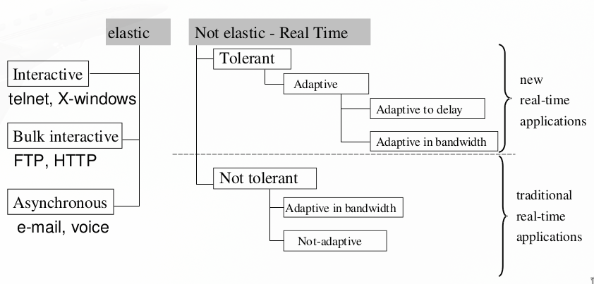

# QoS basis and Procols

With Tcp/IP transport the entities communicate using resources available during execution dynamically **without predefined commitment**.

## Application Classification

- **Elastic:** traditional. Do not present quality constratints
  - Work betterwith low delays and work worst during congestions
  - Interactive with delays less than 200ms
- **Non Elastic**: time constrained modern application
  - Have time constraints, less tolerant. Can not work if are not present enough resources.
  - The service can be adaptive and compromise:
    - Delay adaptive -> audio drop packets
    - bandwidth adaptive -> video that adapt quality

## Stream qos parameters

Functional parameters:

- Promptness in reply
- Bandwidth: quantity of data transmitted bya channel with success per time unit
- Throughput
- Reliability: percentage of success/failures
- **Latency**: the time spent to send an information unit (bit) also meauserd as the round trip time (back and forth). $T_l = T_p + T_x + T_q$
  - $T_p$ : depends on the speed on light inside the medium **(space/speed)**
  - $T_x$ : depends in messages and bandwidth **(dimension/bandwidth)**
  - $T_q$ : delays on intermediate points. **Critical, involves all waiting overhead**
- **Jitter**: variance of the latency. In optimal situation latency is stable.
- **Skew**: Offset between multiple flows composing a unique stream

But also non functional parameters are important.

A good service requires to identify bottlenecks and must consider resource management

- If I send 1 byte: latency is more perceived
- If I send many megabytes: bandwidth is more perceived

**Resource occupation:** product of $latency \times bandwith$

Simple strategies always applied:

- keep pipes full, but time must be considered carefully
- Buffering time inside applciations in typically considered

### Non functional parameters

Evaluated by the final users:

- Image details
- Image accuracy
- responde time in variation
- audio/video synchronization

Qos can be guaranteed only through a negotiated and controlled contract and after provisioning. **Necessity of observation and feedback: monitoring**.

### Quality of experience

- Relevance (priority)
- QoS perceived
- Cost
- security (integrity, authentification)

## Management

Management actions can be both:

- Proactive (static): decided before execution
- Reactive (dynamic): identified during distribution

Focus on **Service Level Agreement**

### Static

- Precise definition of Qos Levels and SLA
- Negotiation
- Admission control: comparison between requested Qos and available resources
- **reservation of resources**: needed resource definition for allocation to obtaion requested QoS
SLA represents the static agreement

### Dynamic

Monitoring of eventaul changes to respect the defined policy

- continuous measurement
- respect synchronization
- renegotiation of necessary resources
- **change of resources** to maintain Qos and adjustment to new situations

**Reservation and change** of resources **are local actions non provided in protocols**

### Active Path

You must find and active path between emitter and receiver, anyway, also by flooding

Among severals must choose one to employ. Intermediate nodes must agree on the negotiated SLA.

The specification of an SLA is always a coordinated eddort among emitters and receivers.

- Emitter: Can i send that specific streaming with that B bandwidth and that A accuracy?
- Receiver: I can accept just that streaming with that B1 bandwidth and that A accuracy, with latency L.

## Management and monitoring

Necessity to match application plane with strategies for efficiency control. Keep in mind the three planes of a service:

- User plane
- Management Plane: must collect data
- Control Plane: takes action based on data

Granting the QoS is high cost. Dynamic data collection mechanism must require not too many resources. **Minum intrusion principle:** monitoring must attempt not to comete with applications for resources.

### OSI System management

Osi distributed management: Use of **standard description of objects and actions**. 

Defines a layer 7 protocol: CMIP (Common Management Information Protocol), which is an implementation for the CMIS (Common Management Information Service), allowing communication between network management applications and management agents. [1](https://en.wikipedia.org/wiki/Common_Management_Information_Protocol)

## Manager/Agent model

Management standard based on two roles:

- manager
- agents: responsible of managed resources

Manager/Agents model can lead to very simple implementation.

### SNMP

Snmp: Simple Network Management Protocol, standard by IETF. It uses TCP/IP, very spread in UNIX systems and LAN environments, SNMP operates on CMIP subset (incompatiblewith CMIP standards).