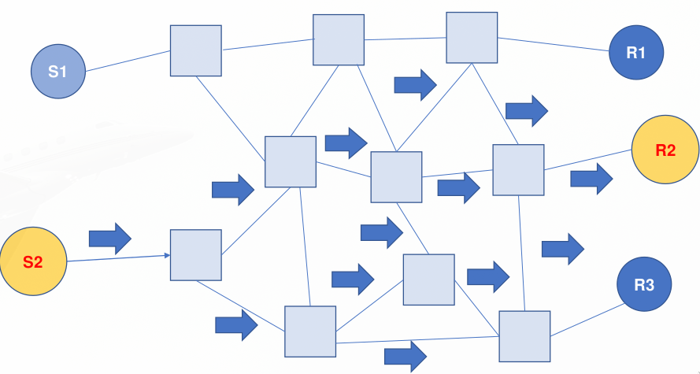
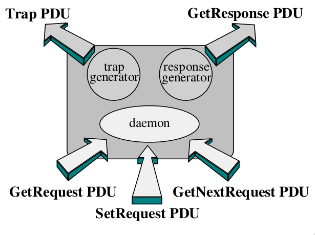
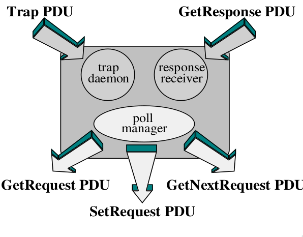
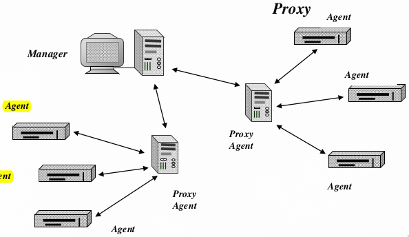

# QoS basis and Procols

With Tcp/IP transport the entities communicate using resources available during execution dynamically **without predefined commitment**.

## Application Classification

- **Elastic:** traditional. Do not present quality constratints
  - Work betterwith low delays and work worst during congestions
  - Interactive with delays less than 200ms
- **Non Elastic**: time constrained modern application
  - Have time constraints, less tolerant. Can not work if are not present enough resources.
  - The service can be adaptive and compromise:
    - Delay adaptive -> audio drop packets
    - bandwidth adaptive -> video that adapt quality

## Stream qos parameters

Functional parameters:

- Promptness in reply
- Bandwidth: quantity of data transmitted bya channel with success per time unit
- Throughput
- Reliability: percentage of success/failures
- **Latency**: the time spent to send an information unit (bit) also meauserd as the round trip time (back and forth). $T_l = T_p + T_x + T_q$
  - $T_p$ : depends on the speed on light inside the medium **(space/speed)**
  - $T_x$ : depends in messages and bandwidth **(dimension/bandwidth)**
  - $T_q$ : delays on intermediate points. **Critical, involves all waiting overhead**
- **Jitter**: variance of the latency. In optimal situation latency is stable.
- **Skew**: Offset between multiple flows composing a unique stream

But also non functional parameters are important.

A good service requires to identify bottlenecks and must consider resource management

- If I send 1 byte: latency is more perceived
- If I send many megabytes: bandwidth is more perceived

**Resource occupation:** product of $latency \times bandwith$

Simple strategies always applied:

- keep pipes full, but time must be considered carefully
- Buffering time inside applciations in typically considered

### Non functional parameters

Evaluated by the final users:

- Image details
- Image accuracy
- responde time in variation
- audio/video synchronization

Qos can be guaranteed only through a negotiated and controlled contract and after provisioning. **Necessity of observation and feedback: monitoring**.

### Quality of experience

- Relevance (priority)
- QoS perceived
- Cost
- security (integrity, authentification)

## Management

Management actions can be both:

- Proactive (static): decided before execution
- Reactive (dynamic): identified during distribution

Focus on **Service Level Agreement**

### Static

- Precise definition of Qos Levels and SLA
- Negotiation
- Admission control: comparison between requested Qos and available resources
- **reservation of resources**: needed resource definition for allocation to obtaion requested QoS
SLA represents the static agreement

### Dynamic

Monitoring of eventaul changes to respect the defined policy

- continuous measurement
- respect synchronization
- renegotiation of necessary resources
- **change of resources** to maintain Qos and adjustment to new situations

**Reservation and change** of resources **are local actions non provided in protocols**

### Active Path

You must find and active path between emitter and receiver, anyway, also by flooding

Among severals must choose one to employ. Intermediate nodes must agree on the negotiated SLA.

The specification of an SLA is always a coordinated eddort among emitters and receivers.

- Emitter: Can i send that specific streaming with that B bandwidth and that A accuracy?
- Receiver: I can accept just that streaming with that B1 bandwidth and that A accuracy, with latency L.

## Management and monitoring

Necessity to match application plane with strategies for efficiency control. Keep in mind the three planes of a service:

- User plane
- Management Plane: must collect data
- Control Plane: takes action based on data

Granting the QoS is high cost. Dynamic data collection mechanism must require not too many resources. **Minum intrusion principle:** monitoring must attempt not to comete with applications for resources.

### OSI System management

Osi distributed management: Use of **standard description of objects and actions**.

Defines a layer 7 protocol: CMIP (Common Management Information Protocol), which is an implementation for the CMIS (Common Management Information Service), allowing communication between network management applications and management agents. [1](https://en.wikipedia.org/wiki/Common_Management_Information_Protocol)

## Agent/Manager model

Management standard based on two roles:

- manager
- agents: responsible of managed resources

Manager/Agents model can lead to very simple implementation.

### SNMP

Snmp: Simple Network Management Protocol, standard by IETF. It uses TCP/IP, very spread in UNIX systems and LAN environments, SNMP operates on CMIP subset (incompatiblewith CMIP standards). Since it was really simple, over the years had passed redefinitions to keep count of:

- security
- flexible management
- existing legacy systems
- not only devices, entities of any type

SNMP uses **one manager (only one)** and **some agents** that control variables representing the objects, identified by **unique names (OID in hierarchical directories)**, stored in the MIB database.

Manager requests actions `(get and set)` and receives response. Agents wait requests and can also send `trap`.

Some messages used on UDP (port 161 messages, port 162 inside manager for trap):

- `Set`
- `Get`
- `Get_Next` (multiple attribute)
- `Trap`

#### SNMP Agents

Must handle requests of get and set form the manager, can generate traps when some events occur.

#### SNMP Manager

Must handles respondes and traps from agents.

#### SNMP Standards

Data description ruled by:

- SMI (structure of management information), to define objects - ASN.1 and BER standard
- MIB (management of information base), to manage direcories of objects - X.500 standard

#### Proxy Agents

A proxy agent is an agent and a manager. Introduced to overcome the problem called **micro management** (i.e., the congestion around manager). The proxy can collect results and send them in an aggregated form.

## Network and traffic Management

Snmp can deal only with variables inside the agents, the processes. To manage the network enter **Remote MONitor, RMON**, designed to give visibility on traffic.

It introduces monitor agents and and the interaction protocol between manager and monitors.

RMON is **oriented toward traffic and bandwidth**, not toward devices.

**Probe** is an entity capable of **monitoring packets** on the network, **can work autonomously** and **also disconnected from the manager** to track subsystems and **report filtered information** to the manager.

Enhance model of distributed management based on:
| | |
| - | - |
| Active entities | Manager |
| Managed entities | Objects |
| Intermediate entities | Agents |

With objects that can be managers themself to organize a flexible hierarchy.

### Advanced network management

Managed object are the resources, described as objects:

- simple resources (a modem)
- comples resources (more interconnected systems)
- can be created dynamically

The managers realized management policies based on managing different agents of other managers (?). A manager can both insert a resource and remove it dynamically.

The agent can also execute actions on manager request.
